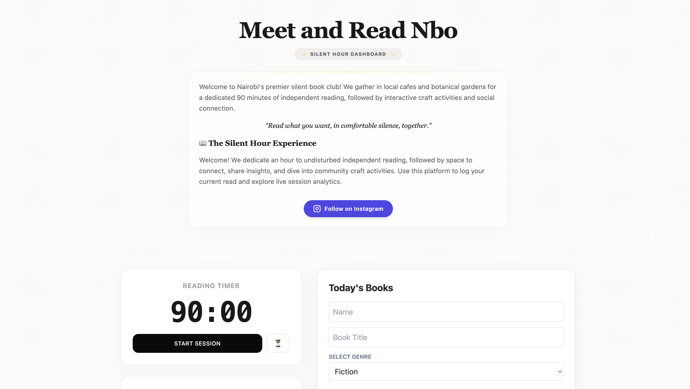

# Silent Hour Dashboard — Meet and Read NBO

This project is a dedicated interactive dashboard for **Meet and Read Nbo**, a community-based silent book club in Nairobi. It streamlines our meetups by managing the independent reading block and facilitating the transition into social activities.

# Meet and Read Nbo - Silent Hour Dashboard



## 1. Problem Statement
During our meetups at local cafes and botanical gardens, it is essential to have a focused, 90-minute independent reading period without the distraction of manual phone alarms. Additionally, as our community grows, we needed a centralized way to track who is attending and what book they are currently reading to help kick-start our interactive post-reading social sessions.

## 2. Framework Choice
I chose **Vue.js** for this project. 
* **Reactivity:** Vue’s `<script setup>` and reactivity system (`ref`, `watch`) allowed me to build a complex, interval-based timer and a persistent data log in under 40 minutes.
* **Development Speed:** Vue's template syntax is highly intuitive, allowing for rapid UI construction that remains readable and maintainable compared to alternative frameworks.

## 3. Technical Decisions
* **Styling:** Utilized **Tailwind CSS** (via CDN) for a clean, professional aesthetic and responsive mobile-first layout.
* **State Management:** Used Vue’s built-in `ref` and `watch` hooks for simple, effective local state management without the need for external libraries like Pinia.
* **Data Persistence:** Implemented browser `localStorage` integration so that user data persists even if the browser is refreshed or closed during the meeting.
* **Animations:** Custom CSS animations were implemented for the header and informational banner to provide a fluid, premium feel.

## 4. How to Run Locally
1. Ensure you have [Node.js](https://nodejs.org/) installed.
2. Clone this repository to your machine.
3. Open your terminal in the project folder and run:
```bash
   npm install
   npm run dev
